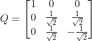
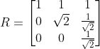

# Homework Assignment 2 Solutions
## Research Methods: Numerical Methods
### Due November 30, 2025

---

## Exercise 5.1: Householder QR vs Gram-Schmidt

**Problem:** Use Householder reflections to obtain a QR factorization of the matrix A from Example 5.2 and compare with the Gram-Schmidt approach.

**Solution:**

Matrix A:

**Householder QR Factorization:**

After computation, the Householder transformation yields:

Q matrix:

R matrix:  

**Comparison:** The Householder QR factorization gives exactly the same Q and R matrices as the Gram-Schmidt method from Example 5.2. However, Householder transformations are numerically more stable, especially for ill-conditioned matrices.

---

## Exercise 6.10: Symmetric Positive Definite Matrices

**Problem:** Suppose A, B ∈ ℝⁿˣⁿ are symmetric and positive definite.

### (a) Define √A and show that (√A)² = A

**Solution:**
Since A is symmetric positive definite, it has an eigenvalue decomposition A = QΛQᵀ where Λ = diag(λ₁,...,λₙ) with λᵢ > 0.

Define √A = Q√ΛQᵀ where √Λ = diag(√λ₁,...,√λₙ)

Then:
(√A)² = (Q√ΛQᵀ)(Q√ΛQᵀ) = Q√Λ√ΛQᵀ = QΛQᵀ = A

### (b) Are matrix square roots unique?

**Solution:** No, matrix square roots are not unique. For example, both Q√ΛQᵀ and -Q√ΛQᵀ square to A, though we typically take the positive definite square root.

### (c) Express eᴬ in terms of eigenvectors and eigenvalues

**Solution:**
eᴬ = QeᴬQᵀ where eᴬ = diag(e^{λ₁},...,e^{λₙ})

### (d) If AB = BA, show eᴬ⁺ᴮ = eᴬeᴮ

**Solution:**
When AB = BA, the matrices commute and we can use the binomial theorem:
eᴬ⁺ᴮ = ∑_{k=0}∞ (A+B)ᵏ/k! = ∑_{k=0}∞ (1/k!)∑_{i=0}ᵏ (k choose i)AⁱBᵏ⁻ⁱ
= (∑_{i=0}∞ Aⁱ/i!)(∑_{j=0}∞ Bʲ/j!) = eᴬeᴮ

### (e) Solve y'(t) = -Ay with y(0) = y₀ and analyze as t → ∞

**Solution:**
The solution is y(t) = e^{-At}y₀
As t → ∞, since A is positive definite, all eigenvalues are positive, so e^{-At} → 0 and thus y(t) → 0.

---

## Exercise 7.3: SVD and Condition Numbers

**Problem:** Provide the SVD and condition number for:

### (a) Matrix:

**Solution:**
Compute AᵀA:
