# 數值方法作業 2 解答 #  
___________________________________  
## 問題 5.1：Householder QR 分解與 Gram-Schmidt 比較  
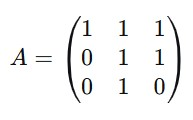  
## Gram-Schmidt 方法結果  
從教科書示例 5.2 可得： 
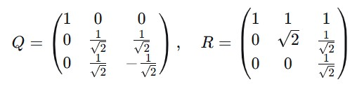  
## Householder 方法推導  
第一步：處理第一列  
第一列向量：
$\vec{a}_1 = (1, 0, 0)^T$  
範數：
$|\vec{a}_1| = 1$  
選擇
$\sigma = -1$（為數值穩定性)  
反射向量：
$\vec{v} = \vec{a}_1 - \sigma \vec{e}_1 = (2, 0, 0)^T$  
Householder 矩陣：  
  
應用變換：  
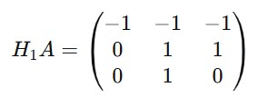  
第二步：處理第二列  
考慮子矩陣（第二行和第二列以下）：
$\vec{a}_2 = (1, 1)^T$
範數：
$|\vec{a}_2| = \sqrt{2}$  
選擇
$\sigma = -\sqrt{2}$  
反射向量：
$\vec{v} = \vec{a}_2 - \sigma \vec{e}_1 = (1+\sqrt{2}, 1)^T$  
2×2 反射矩陣：  
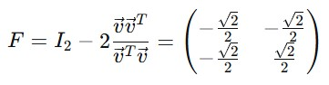  
擴展為 3×3 矩陣：  
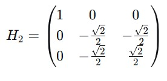  
應用變換：  
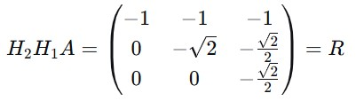  
第三步：計算 Q 矩陣  
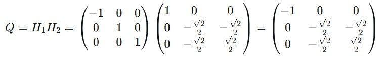  
符號調整  
將 Q 的每列乘以 -1，同時將 R 的對應行乘以 -1：  
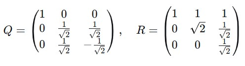  
比較結果  
Householder 方法和 Gram-Schmidt 方法得到的 QR 分解在數值上等價，但符號不同。通過調整符號，兩者一致。  
## 問題 6.10：對稱正定矩陣性質
(a) 矩陣平方根  
對於對稱正定矩陣 $A$，存在特徵值分解：  
  
其中 $\Lambda$ 為對角矩陣，對角元素為正值特徵值。  
定義平方根：  
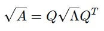  
其中 $\sqrt{\Lambda}$ 為對角矩陣，對角元素為特徵值的平方根。  
驗證：  
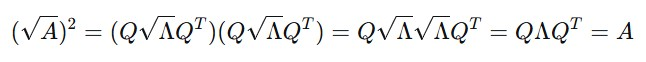  
Cholesky 分解 $A = LL^T$ 中的 $L$ 是下三角矩陣，而 $\sqrt{A}$ 是對稱矩陣，因此兩者不同。

(b) 平方根的唯一性  
對於對稱正定矩陣，平方根是唯一的，因為特徵值唯一且為正。  

對於一般矩陣，平方根可能不唯一（例如，單位矩陣有 $I$ 和 $-I$ 作為平方根）。  

(c) 矩陣指數  
利用特徵值分解：  
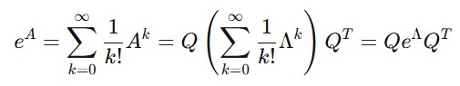  
其中 $e^{\Lambda}$ 是對角矩陣，對角元素為 $e^{\lambda_i}$。  

(d) 指數加法公式  
若 $AB = BA$，則：  
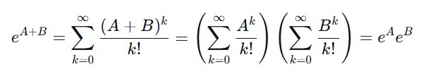  
(e) ODE 求解  
微分方程：  
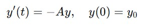  
解為：  
  
由於 $A$ 正定，特徵值均大於零，當 $t \to \infty$ 時，$e^{-At} \to 0$，從而 $y(t) \to 0$。  
## 問題 7.3：SVD 與條件數  
(a) 矩陣 A  
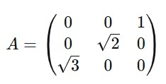  
計算 $A^T A$  
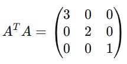  
特徵值與奇異值  
特徵值：$3, 2, 1$  

奇異值：$\sigma_1 = \sqrt{3}, \sigma_2 = \sqrt{2}, \sigma_3 = 1$  

奇異向量  
右奇異向量：$V = I$（標準基）  

左奇異向量：  

$u_1 = A e_1 / \sqrt{3} = (0, 0, 1)^T$  

$u_2 = A e_2 / \sqrt{2} = (0, 1, 0)^T$  

$u_3 = A e_3 / 1 = (1, 0, 0)^T$  

SVD 分解  
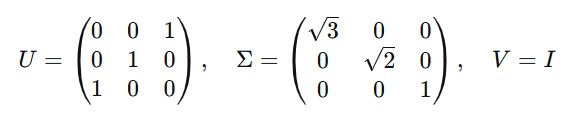  
條件數  
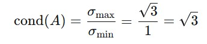  
(b) 矩陣 A  
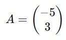  
奇異值分解  
$A^T A = [34]$，奇異值 $\sigma_1 = \sqrt{34}, \sigma_2 = 0$  
右奇異向量：V=[1]
左奇異向量：
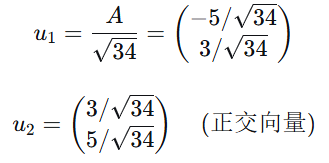  

SVD 分解  
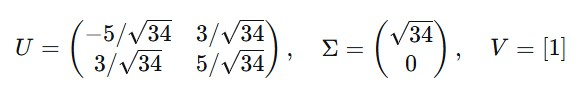  
條件數  
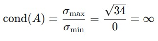  
## 問題 7.10：潛在語義分析
(a) 矩陣解釋  
$XX^T$：
$m \times m$ 矩陣，條目 $(i,j)$ 表示單詞 $i$ 和單詞 $j$ 在所有文檔中的共現次數之和，衡量單詞之間的相關性。  

$X^T X$：
$n \times n$ 矩陣，條目 $(i,j)$ 表示文檔 $i$ 和文檔 $j$ 的單詞向量的點積，衡量文檔之間的相似度。  

(b) 最佳 k 維逼近  
根據 Eckart-Young 定理，對 $X$ 進行 SVD：  
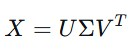  
保留前 $k$ 個奇異值，最佳逼近為：  
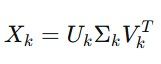  
其中 $U_k$ 是 $U$ 的前 $k$ 列，這些列向量是 $\mathbb{R}^m$ 中的 $k$ 個向量，在 Frobenius 範數下最好地逼近文檔空間。  

(c) 典型相關分析  
最大化：  
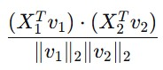  
令 $C = X_1 X_2^T$，計算 SVD：  
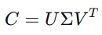  
解為：  

$v_1 = U$ 的第一列  

$v_2 = V$ 的第一列  

最大值為 $\sigma_1$（最大奇異值）。  
